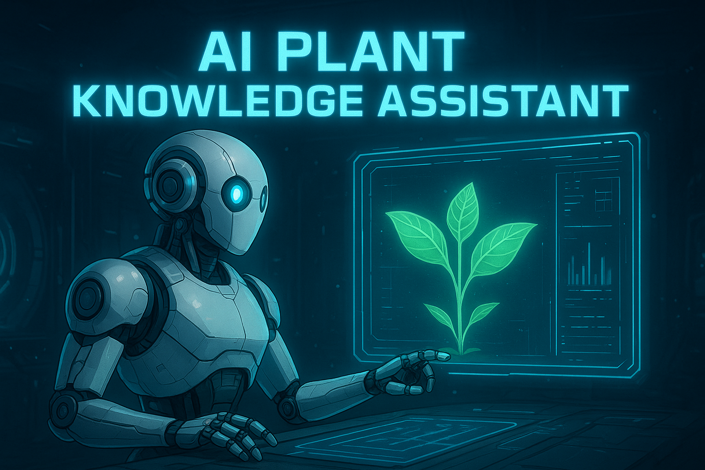
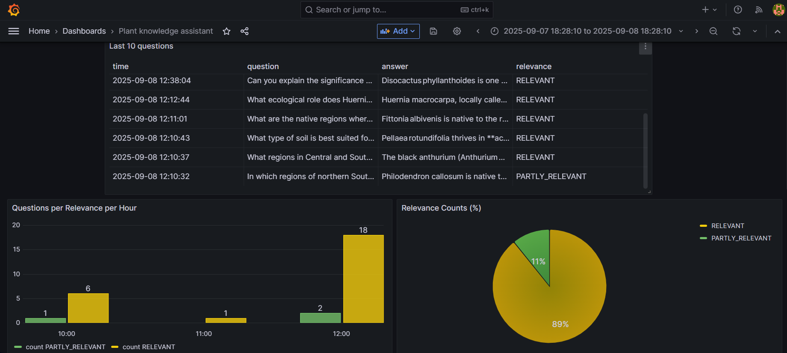
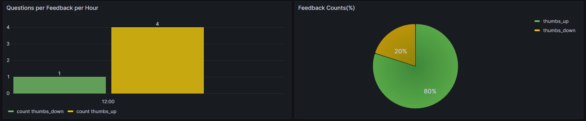
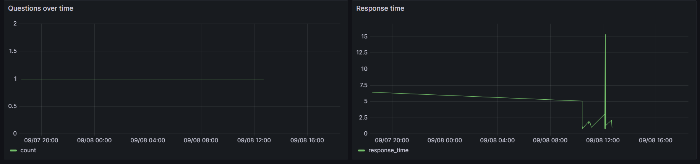

# Plant Knowledge Assistant

## Problem Description

Houseplants improve air quality, reduce stress, and boost productivity, but caring for them can be challenging. Owners often struggle with **knowing each plant’s care needs, understanding toxicity risks for pets, or finding reliable information**.
My project addresses these problems through the development of an intelligent **Retrieval-Augmented Generation (RAG)** application, functioning as a **personal plant assistant**. 
By combining a structured plant database with a conversational AI system, users can ask natural-language questions such as:

- the care requirements of a specific plant, e.g. "How often should I water a Monstera?",
- whether a plant is safe for pets, e.g. “Is Codiaeum variegatum toxic to cats?”,
- the plant’s origin and ideal growing conditions, or
- recommendations for plants that meet certain criteria (e.g., low-light plants safe for dogs).

**The system then provides clear, concise, and factually grounded answers**, enabling owners to care for their plants more confidently and make informed decisions that keep both their plants and pets healthy.


## RAG pipeline

* [plant_knowledge_assistant/rag.py](plant_knowledge_assistant/rag.py)

The **Plant Knowledge Assistant** is built as a **RAG-powered chatbot** (both a knowledge base and an LLM are used in the flow):

- **Retrieval Step (searching in knowledge base)** – When a user asks a question (e.g., *"Which plants are safe for cats?"*), the system searches the dataset for relevant entries.  
- **Augmentation Step (building prompt)** – Retrieved information is combined into a context package for the AI model.  
- **Generation Step (LLM)** – The AI produces a conversational, accurate, and user-friendly answer.  

## Technology

* Python 3.12
* Docker and Docker Compose for containerization
* Hybrid search (jina embeddings + BM25) using Qdrant
* Flask as the API interface
* Grafana for monitoring and PostgreSQL as the backend for it
* openai/gpt-oss-20b as an LLM

## Preparation

### Starting database

Before the application starts for the first time, the database needs to be initialized.

```bash
docker-compose up postgres
```
```bash
pipenv shell

cd plant_knowledge_assistant

export POSTGRES_HOST=localhost
python db_prep.py
````
To check the content of the database, use pgcli (already installed with pipenv):
```bash
pipenv run pgcli -h localhost -U your_username -d course_assistant -W
```

And select from this table:
```bash
select * from conversations;
```

### Update env variable

Since I use GROQ API, you need to provide the API key. To do this insert your key into .env "GROQ_API_KEY" variable.

## 🚀 Running the application 

### Running with docker-compose (Recommended)

The easiest way to run application is using docker-compose:
```bash
docker-compose up 
````
At this point, the API will be available at http://localhost:5000

### Running the application locally

If you want to run the Flask app directly on your machine (instead of inside a Docker container), follow these steps:

1. Install pipenv (dependency manager):
```bash
pip install pipenv
```

2. Once installed, you can install the app dependencies:
```bash
pipenv install --dev
```

3. Start the supporting services (Postgres, Grafana, Qdrant) with Docker:
```bash
docker-compose up postgres grafana qdrant
````

> 💡 **Tip:** If you previously started all applications with docker-compose up, you need to stop the app:
> ```bash
> docker-compose stop app
> ```

4. Initialize and run the app locally

Enter the virtual environment, set environment variables, and start the Flask app:
```bash
pipenv shell
cd plant_knowledge_assistant
export POSTGRES_HOST=localhost
export QDRANT_URL=http://localhost:6333
python app.py
```

At this point, the API will be available at http://localhost:5000

### Running with docker without Compose

If you prefer not to use Docker Compose for the app container, you can run the supporting services separately and then start the app manually.
```bash
docker-compose up postgres grafana qdrant
````
> 💡 **Tip:** If you previously started all applications with docker-compose up, you need to stop the app:
> ```bash
> docker-compose stop app
> ```

2. Build the application image
```bash
docker build -t plant-knowledge-assistant .
```

3. Run the container manually
```bash
docker run -it --rm \
    --network project_plant-knowledge-assistant \
    --env-file=".env" \
    -e DATA_PATH="data/plants_data.csv" \
    -e GROQ_API_KEY=your_api_key \
    -e QDRANT_URL="http://qdrant:6333" \
    -p 5000:5000 \
    plant-knowledge-assistant
```
At this point, the API will be available at http://localhost:5000.

## Sending requests:

Once the application is running, you can interact with it in two ways:

### Using requests

I provided a `test.py` script that automatically picks a random question from the ground-truth dataset and sends it to the API.
```bash
pipenv run python test.py
```

### Using curl

You can also manually send questions to the API using **curl** in your terminal:
```bash
curl -X POST http://localhost:5000/ask \
  -H "Content-Type: application/json" \
  -d '{"question": "What plants are safe for cats?"}'
```

Answer:
```json
{
  "answer": "**Answer**\n\nYes\u2014Monstera plants can be toxic to pets.  \n- **Monstera deliciosa** (the Swiss\u2011cheese plant) is **moderately toxic to cats and dogs** because it contains insoluble calcium oxalate crystals that can irritate the mouth, tongue, digestive tract, and skin.  \n- For **Monstera adansonii** and other Monstera species, the database does not provide toxicity information, so no definitive statement can be made about those specific species.  \n\nIf you have pets that might chew on or lick a Monstera, it\u2019s safest to keep the plant out of reach.",
  "conversation_id": "dc27df41-5cba-4be3-a2b5-0a979460d99b",
  "question": "Is monstera toxic for pets?",
  "timestamp": "2025-08-25T09:07:01.084322"
}
```

Sending feedback:
```bash
  curl -X POST http://localhost:5000/feedback \
  -H "Content-Type: application/json" \
  -d '{"conversation_id": "dc27df41-5cba-4be3-a2b5-0a979460d99b", "feedback": 1}'
```

Answer:
```json
{
  "conversation_id": "dc27df41-5cba-4be3-a2b5-0a979460d99b",
  "feedback": 1,
  "message": "Feedback received successfully"
}
```

## Data Description

The dataset contains **197 records**, each representing a plant species with detailed information, including:  
- **`name`** – Scientific name.  
- **`summary`** – Background information, including origin, appearance, and key characteristics.  
- **`cultivation`** – Care instructions such as watering frequency, light requirements, temperature tolerance (may be empty).
- **`toxicity`** – Toxicity notes (may be empty)

Example entry:
```json
{
  "name": "Monstera deliciosa",
  "summary": "Monstera deliciosa, the Swiss cheese plant or split-leaf philodendron is a species of flowering plant. The common name 'Swiss cheese plant' is also used for the related species from the same genus, Monstera adansonii. The common name 'split-leaf philodendron' is also used for the species Thaumatophyllum bipinnatifidum, although neither species is in the genus Philodendron. Monstera deliciosa is native to tropical forests of southern Mexico, south to Panama. It has been introduced to many tropical areas, and has become a mildly invasive species in Hawaii, Seychelles, Ascension Island and the Society Islands. It is very widely grown in temperate zones as a houseplant. Although the plant contains insoluble calcium oxalate crystals, which cause a needlelike sensation when touched, the ripe fruit is edible.",
  "cultivation": "Monstera deliciosa is commonly grown outdoors as an ornamental plant in the tropics and subtropics. The plant requires a lot of space and a rich and loose soil (ideally garden soil and compost in equal parts). If it grows in the ground it is better to plant it near a tree, where it can climb, if not against a trellis. It is a 'moderately greedy plant' in that it needs to be watered just to keep the soil slightly moist. Its hardiness is 11 (that is to say the coldest at −1 °C or 30 °F). It cannot withstand these temperatures for more than a few hours, but it can live outside in certain temperate regions (Mediterranean coast, Brittany). A steady minimum temperature of at least 13–15 °C (55–59 °F) is preferable, allowing continuous growth. Growth ceases below 10 °C (50 °F) and it is killed by frost. It needs very bright exposure, but not full sun. Forcing a M. deliciosa to flower outside of its typical tropical habitat proves to be difficult. Specific conditions need to be met for the plant to flower. However, in its tropical and subtropical habitat, the plant flowers easily. In ideal conditions it flowers about three years after planting. The plant can be propagated by taking cuttings of a mature plant or by air layering.",
  "toxicity": "Monstera deliciosa is moderately toxic to both cats and dogs because it contains insoluble calcium oxalate crystals (needle-like). This crystal may cause injury to the mouth, tongue, and digestive tract. It also causes dermatitis by direct contact with cat and dog skin."
}
```

### Data generation
I gathered structured information about house plants from Wikipedia webpage: https://en.wikipedia.org/wiki/Category:House_plants. 
You can find collected data and accompanying notebook here:

* Dataset: [data/plants_data.csv](data/plants_data.csv)
* Notebook: [notebooks/getting_data.ipynb](notebooks/getting_data.ipynb)

My code works in two stages:
1. Collecting Plant Names – It scrapes the Wikipedia “House plants” category with BeautifulSoup to extract plant names.
2. Fetching Plant Details – For each plant, it uses the wikipedia library to get a summary and searches the page text for Cultivation and Toxicity sections with regex.

## Retrieval evaluation

To evaluate search results, I built a ground truth dataset. For each plant record, I used an LLM to generate five relevant, self-contained questions.

* Dataset: [data/ground-truth-retrieval-5q.csv](data/ground-truth-retrieval-5q.csv)
* Notebook: [notebooks/generating_ground_truth_dataset.ipynb](notebooks/generating_ground_truth_dataset.ipynb)

With this dataset linking questions to the correct answer (plant record), I evaluated different search methods for retrieval performance.
* Notebook: [notebooks/evaluating_retrieval.ipynb](notebooks/evaluating_retrieval.ipynb)

The table below reports **Hit Rate, Recall at First Position, and Mean Reciprocal Rank (MRR)**, where higher values indicate better performance. 
The **hybrid search** method achieves the best overall results. It combines dense semantic search (Jina embeddings) and sparse keyword search (BM25) in a multi-stage retrieval and reranking process.

| Method                      | Hit Rate | Recall @ First Pos | MRR     |
|-----------------------------|----------|--------------------|---------|
| minsearch                   | 0.895 | 0.822           | 0.848|
| vector_search_tfidf_svd     | 0.922 | 0.801           | 0.853|
| vector_search_jina_emb      | 0.928 | 0.861        | 0.887|
| hybrid_search_jina_emb_bm25 | 0.941 | 0.871           | 0.900|


## LLM evaluation

* Notebook: [notebooks/evaluating_rag.ipynb](notebooks/evaluating_rag.ipynb)

Using the search results as context, I prompted the LLM to answer questions from the ground truth dataset.  
Then I used LLM as a judge method to evaluate answers generated by two different LLMs:
* openai/gpt-oss-20b (Groq API https://console.groq.com with 1000 free requests for this model)
* gemini-2.5-flash-lite (Google API https://aistudio.google.com/app/apikey with 1000 free requests for this model)

The table below shows the proportion of responses judged by LLM as **RELEVANT**, **PARTLY_RELEVANT**, or **NON_RELEVANT** for two different prompts.  The best results were obtained with GPT-OSS and prompt1.

| Model / Prompt                  | RELEVANT | PARTLY_RELEVANT | NON_RELEVANT |
|---------------------------------|----------|-----------------|--------------|
| GPT OSS PROMPT1 (200, 7)        | 0.905    | 0.085           | 0.010        |
| GPT OSS PROMPT2 (200, 7)        | 0.830    | 0.130           | 0.040        |
| GEMINI FLASH 2.5 LITE PROMPT1 (200, 7) | 0.705    | 0.255           | 0.040        |
| GEMINI FLASH 2.5 LITE PROMPT2 (200, 7) | 0.670    | 0.230           | 0.100        |

# API

## Ingestion pipeline

* [plant_knowledge_assistant/ingest.py](plant_knowledge_assistant/ingest.py)

Based on retrieval experiment results, I developed a Python script to prepare the plant dataset for the RAG pipeline. The script connects to Qdrant, creates a collection with dense embeddings (Jina) for semantic search and sparse embeddings (BM25) for keyword matching, and converts each dataset row into a vector point with metadata. Once ingested, the data can be efficiently retrieved and used by a language model for question answering.

## Inference

* [plant_knowledge_assistant/app.py](plant_knowledge_assistant/app.py)

I used Flask app provides for interacting with the RAG system:

- **`POST /ask`** – Submit a question and receive an answer from the RAG pipeline.  
  Returns a unique `conversation_id` along with the question, answer and timestamp.  

- **`POST /feedback`** – Submit feedback (`+1` or `-1`) for a given `conversation_id`.  
  Useful for tracking performance and improving the system over time.  

- **`GET /health`** – Simple health check endpoint to verify the service is running.  

Conversations are stored in database with fields for `conversation_id`, `question`, `answer`, `response_time`, `relevance`, `relevance_explanation`, `timestamp`, and optional `feedback`. 
Feedback is stored in database with fields for `conversation_id` and  `feedback`.


## 📊 Monitoring

The app is monitored with **Grafana** connected to **PostgreSQL**, which stores conversation logs and feedback.  

### 🔍 Dashboard Details

- **Last 10 Questions (Table)** – recent user queries with answers and relevance.  
- **Questions Over Time (Time Series)** – query volume trend.  
- **Questions per Relevance per Hour (Bar Chart)** – relevance distribution by time.  
- **Questions per Feedback per Hour (Bar Chart)** – positive vs. negative feedback per hour.  
- **Feedback Counts (%) (Pie Chart)** – overall thumbs up/down ratio.  
- **Relevance Counts (%) (Pie Chart)** – share of relevant vs. non-relevant answers.  
- **Response Time (Time Series)** – AI latency monitoring.  

⏱ Dashboard refreshes every **30s** for near real-time monitoring.  




## 📂 Project Structure

```
llm-zoomcamp-rag-project/
│   .env                      # Environment variables (API keys, configs)
│   .gitignore                # Git ignore rules
│   docker-compose.yaml       # Docker Compose config for services
│   Dockerfile                # Docker build instructions
│   Pipfile                   # Python dependencies (Pipenv)
│   Pipfile.lock              # Locked dependency versions
│   README.md                 # Project documentation
│   test.py                   # Basic test script
│
├── data/                     # Datasets for evaluation and its results
│   ├── ground-truth-retrieval-5q.csv
│   ├── plants_data.csv
│   ├── rag_eval_gemini_flash_2_5_lite_prompt1.csv
│   ├── rag_eval_gemini_flash_2_5_lite_prompt2.csv
│   ├── rag_eval_gpt_oss_prompt1.csv
│   └── rag_eval_gpt_oss_prompt2.csv
│
├── grafana/                  # Monitoring setup for Grafana
│   ├── dashboard.json        # Dashboard configuration
│   └── init.py               # Grafana initialization script
│
├── images/                   # Project images and diagrams
│   ├── image1.png
│   ├── image2.png
│   ├── image3.png
│   └── plant_knowledge_assistant.png
│
├── notebooks/                # Jupyter notebooks for experiments
│   ├── evaluating_rag.ipynb
│   ├── evaluating_retrieval.ipynb
│   ├── generating_ground_truth_dataset.ipynb
│   └── getting_data.ipynb
│
└── plant_knowledge_assistant/ # Core application code
    ├── app.py                # Main app entry point
    ├── db.py                 # Database setup and operations
    ├── db_prep.py            # Database initialization script
    ├── ingest.py             # Data ingestion pipeline
    └── rag.py                # RAG (Retrieval-Augmented Generation) logic
```


